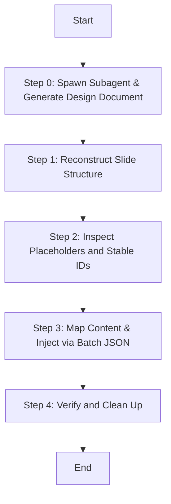

# Populating Office Templates

## Overview
A visual-preserving workflow to clone, reconstruct, and inject text elements into pre-designed Office templates. This technique targets unique OpenXML shape IDs rather than fragile literal strings, ensuring fonts, colors, and visual layouts remain 100% correct.

## Dependencies
This skill requires the following toolchain to be available:
1. **`officecli`** (Must be installed and present in the system PATH).
2. **Python 3.x** (Only uses Python built-in standard libraries; no external `pip` dependencies are required).

## When to Use
- When migrating content from a source document (e.g. Markdown Business Plan) into a pre-designed PowerPoint (.pptx) or Word (.docx) template.
- When slide structures need to be reordered or cloned before text filling.
- When literal find-and-replace fails due to style splits or newlines `\n` in template text.

## Core Process: Plan-Reconstruct-Inspect-Inject (PRII)



### Step 0: Generate Design & Planning Document (Subagent Task)
Before starting any PPT modifications, you MUST define a dedicated planning document to align visual constraints and content requirements.
To do this:
1. **Spawn a Subagent**: Use `define_subagent` and `invoke_subagent` to delegate this task to a researcher/planner subagent.
2. **Subagent Prompt Requirements**:
   Provide the subagent with the following strict execution prompt:
   ```markdown
   ## 执行步骤（严格按顺序）

   ### 第一步：分析模板的真实视觉规范（必须最先执行）
   使用 ppt-master / officecli 打开 PPT 模板文件，逐页提取以下信息：
   1. 配色方案：模板实际使用的主色、辅色、强调色的具体色值（RGB/HEX），包括背景色、文字色、装饰线条色、图表色。
   2. 字体方案：模板实际使用的字体名称（中文字体+英文字体）、各层级字号的实际数值（标题/副标题/正文/注释）、字重（Regular/Medium/Bold）。
   3. 版式清单：列出模板中每一页的版式类型、用途和布局结构（单栏/双栏/三栏/网格），标注可复用场景。
   ⚠️ 以上所有信息必须来自对模板的实际分析，严禁臆造。在没有完成模板分析之前，不得进入第二步。

   ### 第二步：内容提取与分析
   1. 精读商业计划书/示例文档，提取每章节的核心数据、关键结论和亮点表述。
   2. 分析 PPT 结构参考或大纲，确认每部分的页数分配。

   ### 第三步：逐页规划
   基于第一步提取的模板版式，为每一页 PPT 规划：
   - 页面标题
   - 核心内容（精炼为 3-5 个要点，拒绝大段文字）
   - 数据/图表需求（从商业计划书提取的具体数据）
   - 模板版式匹配（对应模板中的具体页码和版式）
   - 操作说明（替换文本 / 删除页面 / 合并页面）

   ### 第四步：输出开发文档

   ## 约束条件
   - 视觉规范约束：配色、字体、版式 100% 来自模板，严禁模糊表述与自定义。
   - 内容与结构约束：不插入 SVG，只替换文本保留原有排版结构；数据驱动（源于计划书）；投资人视角；严格控制总页数（如 19-21 页）；每页要点不超过 5 条（每条控制在 25 字以内）。
   ```
3. **Planning Document Output Format**:
   Ensure the subagent outputs the planning document following this markdown structure:
   - **1. 模板视觉规范提取**：配色表、字体层级表、版式清单。
   - **2. 逐页规划表**：包含页码、章节、页面类型、标题、核心内容要点、数据/图表、模板版式、操作说明。
   - **3. 操作清单**：保留页、删除页、合并页、新增/复制页清单。
   - **4. 验证标准**：核对清单。

Only proceed to **Step 1** after this Design Planning Document is fully written to a local `.md` file (e.g., `Result/ppt_development_document.md`) and verified.

### Step 1: Reconstruct Slide Structure (Atomic Batch)
Never add or remove slides sequentially in separate CLI commands inside loops. Doing so shifts index numbers dynamically and leads to collision or lock errors.
Always copy the template first, compile all clone (`add --from`) and `remove` commands into a single JSON batch array, and execute them in one atomic process.

### Step 2: Inspect Placeholders and Stable IDs
Run the extraction script to map the slide textboxes.
`python scripts/extract_placeholders.py Templates/my_template.pptx Tmp/placeholders.json`
This generates a schema mapping absolute paths (e.g., `/slide[1]/shape[@id=100002]`) to their current placeholder values.

### Step 3: Map Content and Inject
Map your business text into the placeholders. Create an injection JSON file (saved inside `Tmp/`) containing a list of `set` commands:
```json
[
  {
    "command": "set",
    "path": "/slide[1]/shape[@id=100002]",
    "props": {"text": "生息守护"}
  }
]
```
Apply the changes in a single transaction to the file in `Result/`:
`python scripts/batch_injector.py Result/my_output.pptx Tmp/mapping.json`
*(Or run `officecli batch Result/my_output.pptx --input Tmp/updates.json --stop-on-error`)*

## Common Mistakes & Red Flags
- ❌ **Matching text by search (find=...) when unique IDs are available.** Newline characters and runtime spans split the string in OOXML, causing match failures.
- ❌ **Modifying a presentation while it is open in WPS or Microsoft Office.** Lock conflicts will corrupt the output.
- ❌ **Inserting raw SVG shapes.** This breaks PowerPoint's native shape formatting and compatibility.
