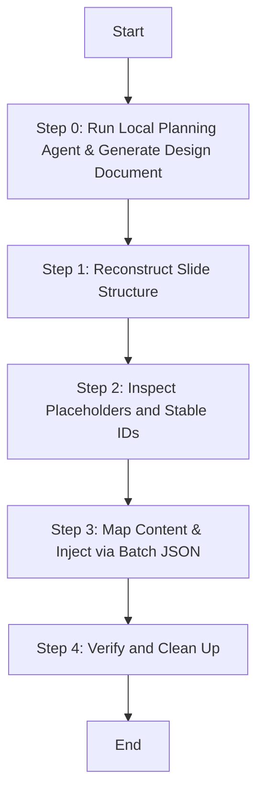

# Populating Office Templates

## Overview
A visual-preserving workflow to clone, reconstruct, and inject text elements into pre-designed Office templates. This technique targets unique OpenXML shape IDs rather than fragile literal strings, ensuring fonts, colors, and visual layouts remain 100% correct.

## Dependencies
This skill requires the following toolchain to be available:
1. **`officecli`** (Must be installed and present in the system PATH).
2. **Python 3.x** (Only uses Python built-in standard libraries; no external `pip` dependencies are required).

## When to Use
- When migrating content from a source document (e.g. Markdown Business Plan) into a pre-designed PowerPoint (.pptx) or Word (.docx) template.
- When slide structures need to be reordered or cloned before text filling.
- When literal find-and-replace fails due to style splits or newlines `\n` in template text.

## Core Process: Plan-Reconstruct-Inspect-Inject (PRII)



### Step 0: Generate Design & Planning Document (Planning Agent Task)
Before starting any PPT modifications, you MUST run the automated local Planning Agent to analyze the template and compile the planning document.

#### How to Run:
Execute the planning agent script using Python:
`python scripts/ppt_planning_agent.py --template <template_path> --source <source_md_path> --ref <ref_txt_path> --output Result/ppt_development_document.md`

#### Agent Mechanism:
1. **Physical Specs Extraction**: The script directly unzips the `.pptx` and extracts theme colors and fonts from `ppt/theme/theme1.xml` to avoid hallucinating color/font names.
2. **Layout & Text Matching**: The script calls `extract_placeholders.py` (or falls back to pure Python XML reading if the file is locked by MS Office/WPS) to extract text content of each slide layout.
3. **LLM Automation & Fallback**:
   - **Auto Mode**: If environment variables like `LLM_API_KEY`, `OPENAI_API_KEY` or `GEMINI_API_KEY` are present, the agent automatically hits the LLM API (via built-in zero-dependency `urllib`) to write the planning markdown file directly to `Result/ppt_development_document.md`.
   - **Manual Mode**: If no API Key is provided, the agent writes a fully-assembled, high-fidelity prompt containing all visual data and plan structures to `Result/prompt_for_llm.md` for you to copy and paste to any Web LLM, saving the output back to `Result/ppt_development_document.md`.

Only proceed to **Step 1** after the Design Planning Document is fully generated, verified, and saved to `Result/ppt_development_document.md`.

### Step 1: Reconstruct Slide Structure (Atomic Batch)
> ⚠️ **Before writing any files**: Confirm with the user that the output path in `Result/` is acceptable. If a file already exists at that path, ask whether to overwrite or use a new filename.

Never add or remove slides sequentially in separate CLI commands inside loops. Doing so shifts index numbers dynamically and leads to collision or lock errors.
Always copy the template first, compile all clone (`add --from`) and `remove` commands into a single JSON batch array, and execute them in one atomic process.

### Step 2: Inspect Placeholders and Stable IDs
Run the extraction script to map the slide textboxes.
`python scripts/extract_placeholders.py Templates/my_template.pptx Tmp/placeholders.json`
This generates a schema mapping absolute paths (e.g., `/slide[1]/shape[@id=100002]`) to their current placeholder values.

### Step 3: Map Content and Inject
Map your business text into the placeholders. Create an injection JSON file (saved inside `Tmp/`) containing a list of `set` commands:
```json
[
  {
    "command": "set",
    "path": "/slide[1]/shape[@id=100002]",
    "props": {"text": "生息守护"}
  }
]
```
Apply the changes in a single transaction to the file in `Result/`:
`python scripts/batch_injector.py Result/my_output.pptx Tmp/mapping.json`
*(Or run `officecli batch Result/my_output.pptx --input Tmp/updates.json --stop-on-error`)*

### Step 4: Verify and Clean Up
After injection, run the following verification:

1. **Visual spot-check**: Open the output `.pptx` from `Result/` and confirm slides match the design document (`Result/ppt_development_document.md`).
2. **Error log review**: Check the console output from `batch_injector.py` — if any `set` commands failed, report the failed paths to the user.
3. **File integrity**: Confirm the output file size is reasonable (not 0 bytes or suspiciously small).

**Verdict**: If all checks pass, report success. If any injection failed, list the failed shape paths and suggest manual review.

## Common Mistakes & Red Flags
- ❌ **Matching text by search (find=...) when unique IDs are available.** Newline characters and runtime spans split the string in OOXML, causing match failures.
- ❌ **Modifying a presentation while it is open in WPS or Microsoft Office.** Lock conflicts will corrupt the output.
- ❌ **Inserting raw SVG shapes.** This breaks PowerPoint's native shape formatting and compatibility.

## Next Steps
- Review the generated `.pptx` in PowerPoint or WPS to confirm visual fidelity.
- If specific slides need adjustment, re-run Step 2–3 for those slides only.
- To process a different template, repeat from Step 0 with the new template path.
